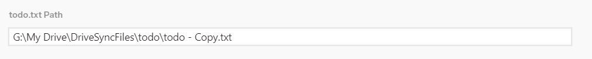
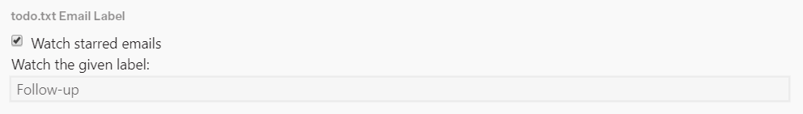
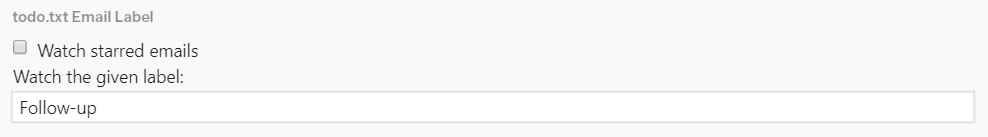
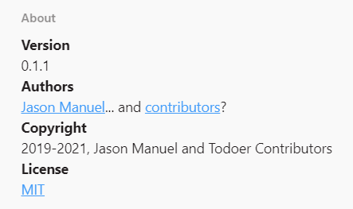

# **todoer**: A [Mailspring](https://getmailspring.com) plugin

Automatically add an email to your local
[todo.txt](https://github.com/todotxt/todo.txt) when you star or label it.

## What is it?

todoer is a Mailspring plugin that adds emails to your todo.txt whenever you
star them. The path to the todo file is configurable in a todoer tab under
Preferences (<kbd>Ctrl</kbd>+<kbd>Comma</kbd> on Windows). The plugin acts
completely locally--there's no sign-in to worry about! It even works with
todo.txt files that are synced over a cloud service.

## Features

* Puts your actionable email threads into your to-do list for you!
* Works with a `todo.txt` anywhere in your file system (as long as it has a
  valid path).
* Each to-do item created from the subject and date of the thread.

## Installation

Download a release from [the releases
page](https://github.com/jmanuel1/todoer/releases) or clone the repository using
`git clone https://github.com/jmanuel1/todoer.git`. If you downloaded a release,
unzip into a folder.

In the folder containing the release, run `yarn build`. Next, open Mailspring.
In the menu, choose `Developer > Install a Plugin...`. Then choose the folder
containing the plugin. Note that installation might freeze Mailspring for a
while.

## Usage

todoer's settings can be accessed from Mailspring's preferences under a special
todoer tab.

### Getting started

In the todoer preferences tab, point todoer at your `todo.txt` by entering its
path into the 'todo.txt Path' field. The file must already exist!

Under the 'todo.txt Email Label' section, you can choose which category of
emails to send to your `todo.txt`. If you check 'Watch starred emails', emails
will be added to your todo list when star them and removed when you unstar them.

If 'Watch starred emails' is unchecked, you can enter the name of a label into
the 'Watch the given label:' text field. When you add this label to an email,
the email will be added to your todo list. When your remove that label from an
email in your todo list, the email will be taken out of the todo list.

### The 'About' section

The 'About' section of the todoer preferences tab contains information about
this plugin, namely:

* The version.
* The authors.
* A copyright notice.
* A link to the [license](LICENSE.md) under which todoer is available.

## Development

Development should be done under Node **10.10+**.

This project uses Yarn as the package manager and npm scripts for build scripts.
Make sure to run `yarn` before you start development.

To build the plugin, use `yarn build`. You should get a `lib/main.js` file. To
test the build, use `yarn test`.

[Mailspring's API documentation](https://foundry376.github.io/Mailspring/) is
currently quite lacking, so there are [additional
notes](https://github.com/jmanuel1/todoer/wiki/Unofficial-Mailspring-API-Docs)
to supplement Mailspring's docs.

### Directory structure

Plugin code goes in `lib/`, tests/specs go in `spec/`.

`lib/` subfolders:

* `email-to-todo/`: code that converts email objects to todo.txt objects
* `settings/`: code that manages the plugin user preferences
* `changed-thread/`: code that grabs email threads upon any state change (like
  a star or labels) and fires events when the change is relevant to the plugin
* `todo-txt/`: handles the creation of todo objects, reading and writing of
  `todo.txt`
* `ui/`: user interface components

### Tests

Please add tests with your changes. Tests are written with
[Jasmine](https://jasmine.github.io).

## Roadmap

* Stability improvements
  * See issue #1 (partially fixed)
* Offer installable builds
  * This may be difficult since, as far as I know, Mailspring doesn't have a
    user-friendly way of installing plugins yet
* Work with folders too
  * This use case is not explicitly handled yet, and it is unknown if it works.
