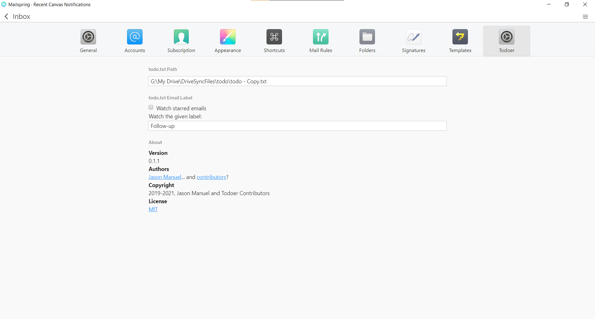

# **todoer**: A [Mailspring](https://getmailspring.com) plugin

Automatically add an email to your local
[todo.txt](https://github.com/todotxt/todo.txt) when you star it.

## What is it?

todoer is a Mailspring plugin that adds emails to your todo.txt whenever you
star them. The path to the todo file is configurable in a todoer tab under
Preferences (<kbd>Ctrl+Comma</kbd> on Windows). The plugin acts completely
locally--there's no sign-in to worry about! It even works with todo.txt files
that are synced over a cloud service.

## Development

Development should be done under Node **10.10+**.

This project uses Yarn as the package manager and npm scripts for build scripts.
Make sure to run `yarn` before you start developmwnt.

To build the plugin, use `yarn build`. You should get a `lib/main.js` file. To
test the build, use `yarn test`.

[Mailspring's API documentation](https://foundry376.github.io/Mailspring/) is
currently quite lacking, so there are [additional notes](docs/mailspring.md) to
supplement Mailspring's docs.

### Directory structure

Plugin code goes in `lib/`, tests/specs go in `spec/`.

`lib/` subfolders:

* `email-to-todo/`: code that converts email objects to todo.txt objects
* `settings/`: code that manages the plugin user preferences
* `starred-emails/`: code that grabs emails as they are starred
* `todo-txt/`: handles the creation of todo objects, reading and writing of
  `todo.txt`
* `ui/`: user interface components

### Tests

Please add tests with your changes. Tests are written with
[Jasmine](https://jasmine.github.io).

## Roadmap

1. Write up a README, including relevant details about Mailspring's APIs.
1. Turn services into Reflux stores. See
   https://foundry376.github.io/Mailspring/guides/Architecture.html.
2. Correct generated todos like
   `(undefined) 2019-08-04 Your ride with Duane on August 4 + @`
3. Prevent duplicate todos from being generated
4. Tag generated todos as being from the email context (`@email`)
5. Remove unstarred emails from todo.txt
