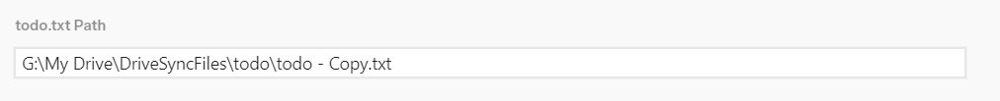
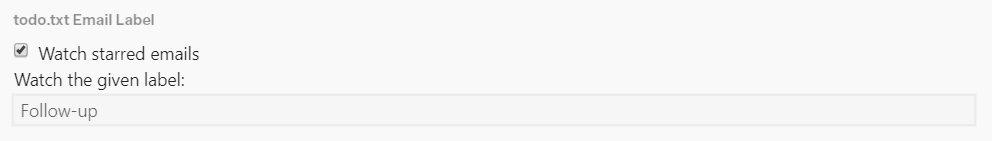
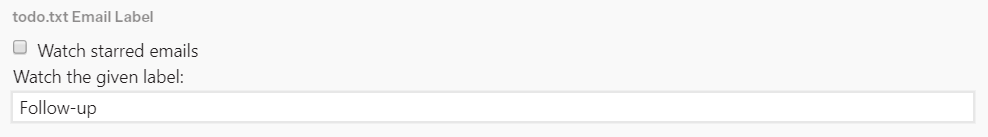
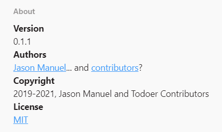

# How to use todoer

todoer's settings can be accessed from Mailspring's preferences under a special
todoer tab. You'll likely want to start there.

## Getting started

In the todoer preferences tab, point todoer at your `todo.txt` by entering its
path into the 'todo.txt Path' field. The file must already exist!

Under the 'todo.txt Email Label' section, you can choose which category of
emails to send to your `todo.txt`. If you check 'Watch starred emails', emails
will be added to your todo list when star them and removed when you unstar them.

If 'Watch starred emails' is unchecked, you can enter the name of a label into
the 'Watch the given label:' text field. When you add this label to an email,
the email will be added to your todo list. When your remove that label from an
email in your todo list, the email will be taken out of the todo list.

## The 'About' section

The 'About' section of the todoer preferences tab contains information about
this plugin, namely:

* The version.
* The authors.
* A copyright notice.
* A link to the [license](../LICENSE.md) under which todoer is available.
